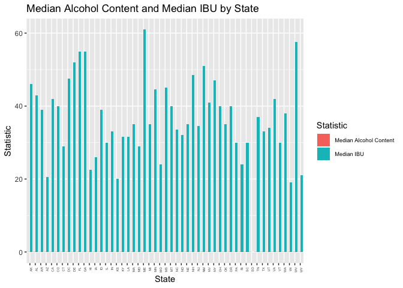
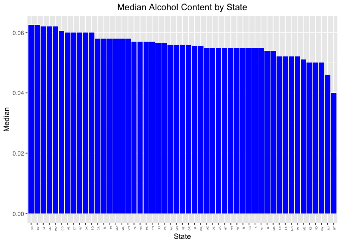
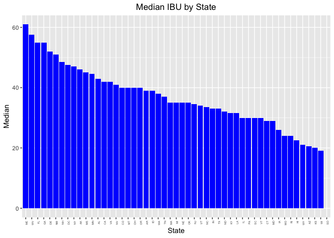
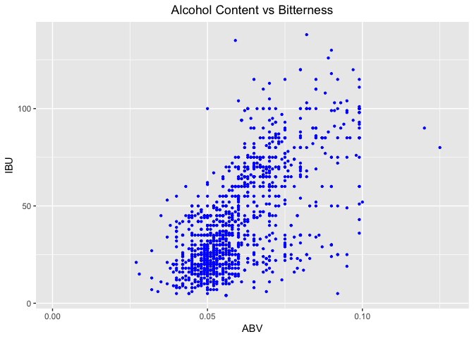

#Introduction
As an Oregon based brewery we understand your desire to expand across the nation away from your corner in the United States. We also understand you would like to know more about other state's breweries to see which direction you should go with your beers. We have analyzed the data you have presented us with and made a few observations to help your cause when making this expansion.


##Question 1
First we checked how many breweries are present in each state. Targeting states with fewer breweries should help you target where you can inflitrate and make your presence known.


```r
library(ggplot2)
```

```
## Warning: package 'ggplot2' was built under R version 3.4.4
```

```r
library(dplyr)
```

```
## Warning: package 'dplyr' was built under R version 3.4.4
```

```
## 
## Attaching package: 'dplyr'
```

```
## The following objects are masked from 'package:stats':
## 
##     filter, lag
```

```
## The following objects are masked from 'package:base':
## 
##     intersect, setdiff, setequal, union
```

```r
breweries = read.csv('/Users/spencerfogelman/Desktop/SMUDataScience/CapstoneProject/Breweries.csv', stringsAsFactors = FALSE)
beers = read.csv('/Users/spencerfogelman/Desktop/SMUDataScience/CapstoneProject/Beers.csv', stringsAsFactors = FALSE)

head(breweries)
```

```
##   Brew_ID                      Name          City State
## 1       1        NorthGate Brewing    Minneapolis    MN
## 2       2 Against the Grain Brewery    Louisville    KY
## 3       3  Jack's Abby Craft Lagers    Framingham    MA
## 4       4 Mike Hess Brewing Company     San Diego    CA
## 5       5   Fort Point Beer Company San Francisco    CA
## 6       6     COAST Brewing Company    Charleston    SC
```

```r
head(beers)
```

```
##                  Name Beer_ID   ABV IBU Brewery_id
## 1            Pub Beer    1436 0.050  NA        409
## 2         Devil's Cup    2265 0.066  NA        178
## 3 Rise of the Phoenix    2264 0.071  NA        178
## 4            Sinister    2263 0.090  NA        178
## 5       Sex and Candy    2262 0.075  NA        178
## 6        Black Exodus    2261 0.077  NA        178
##                            Style Ounces
## 1            American Pale Lager     12
## 2        American Pale Ale (APA)     12
## 3                   American IPA     12
## 4 American Double / Imperial IPA     12
## 5                   American IPA     12
## 6                  Oatmeal Stout     12
```

```r
breweries %>% group_by(State) %>% summarise(Total = n()) %>% arrange(Total)
```

```
## Warning: package 'bindrcpp' was built under R version 3.4.4
```

```
## # A tibble: 51 x 2
##    State Total
##    <chr> <int>
##  1 " DC"     1
##  2 " ND"     1
##  3 " SD"     1
##  4 " WV"     1
##  5 " AR"     2
##  6 " DE"     2
##  7 " MS"     2
##  8 " NV"     2
##  9 " AL"     3
## 10 " KS"     3
## # ... with 41 more rows
```

Here we can see that DC, North Dakota, South Dakota, and West Virginia only have one brewery.

##Question 2
Next we merged the Beer dataset you presented to us with the breweries dataset. This will help us in our analysis moving forward.


```r
merged = merge(x = breweries, y = beers, by.x = 'Brew_ID', by.y= 'Brewery_id', all = TRUE)
head(merged, 6)
```

```
##   Brew_ID             Name.x        City State        Name.y Beer_ID   ABV
## 1       1 NorthGate Brewing  Minneapolis    MN       Pumpion    2689 0.060
## 2       1 NorthGate Brewing  Minneapolis    MN    Stronghold    2688 0.060
## 3       1 NorthGate Brewing  Minneapolis    MN   Parapet ESB    2687 0.056
## 4       1 NorthGate Brewing  Minneapolis    MN  Get Together    2692 0.045
## 5       1 NorthGate Brewing  Minneapolis    MN Maggie's Leap    2691 0.049
## 6       1 NorthGate Brewing  Minneapolis    MN    Wall's End    2690 0.048
##   IBU                               Style Ounces
## 1  38                         Pumpkin Ale     16
## 2  25                     American Porter     16
## 3  47 Extra Special / Strong Bitter (ESB)     16
## 4  50                        American IPA     16
## 5  26                  Milk / Sweet Stout     16
## 6  19                   English Brown Ale     16
```

```r
tail(merged, 6)
```

```
##      Brew_ID                        Name.x          City State
## 2405     556         Ukiah Brewing Company         Ukiah    CA
## 2406     557       Butternuts Beer and Ale Garrattsville    NY
## 2407     557       Butternuts Beer and Ale Garrattsville    NY
## 2408     557       Butternuts Beer and Ale Garrattsville    NY
## 2409     557       Butternuts Beer and Ale Garrattsville    NY
## 2410     558 Sleeping Lady Brewing Company     Anchorage    AK
##                         Name.y Beer_ID   ABV IBU                   Style
## 2405             Pilsner Ukiah      98 0.055  NA         German Pilsener
## 2406         Porkslap Pale Ale      49 0.043  NA American Pale Ale (APA)
## 2407           Snapperhead IPA      51 0.068  NA            American IPA
## 2408         Moo Thunder Stout      50 0.049  NA      Milk / Sweet Stout
## 2409  Heinnieweisse Weissebier      52 0.049  NA              Hefeweizen
## 2410 Urban Wilderness Pale Ale      30 0.049  NA        English Pale Ale
##      Ounces
## 2405     12
## 2406     12
## 2407     12
## 2408     12
## 2409     12
## 2410     12
```

##Question 3
To understand how complete the merged dataset is we checked how many NA values are in each column.


```r
for (i in 1:length(names(merged))){
  column = merged[,i]
  nas = sum(is.na(column))
  print(paste(names(merged)[i], ':', nas))
}
```

```
## [1] "Brew_ID : 0"
## [1] "Name.x : 0"
## [1] "City : 0"
## [1] "State : 0"
## [1] "Name.y : 0"
## [1] "Beer_ID : 0"
## [1] "ABV : 62"
## [1] "IBU : 1005"
## [1] "Style : 0"
## [1] "Ounces : 0"
```


##Question 4
We then computed the median alcohol content and IBU for each state, this should help you get an idea of how strong and how bitter people in different states prefer their beer.


```r
summarydf = merged %>% group_by(State) %>% summarise(MedianAlcoholContent = median(ABV, na.rm=TRUE),
                                         MedianIBU = median(IBU, na.rm=TRUE))

summarydf
```

```
## # A tibble: 51 x 3
##    State MedianAlcoholContent MedianIBU
##    <chr>                <dbl>     <dbl>
##  1 " AK"               0.056       46  
##  2 " AL"               0.06        43  
##  3 " AR"               0.052       39  
##  4 " AZ"               0.055       20.5
##  5 " CA"               0.058       42  
##  6 " CO"               0.0605      40  
##  7 " CT"               0.06        29  
##  8 " DC"               0.0625      47.5
##  9 " DE"               0.055       52  
## 10 " FL"               0.057       55  
## # ... with 41 more rows
```

```r
library(reshape2)
summarydfLong = melt(summarydf, id.vars='State')
ggplot(summarydfLong, aes(x=State, y=value, fill=variable)) + 
  geom_bar(stat='identity', position = 'dodge') +
  theme(axis.text.x = element_text(angle = 90, hjust = 1, size = 4), legend.text=element_text(size=7)) +
  labs(title='Median Alcohol Content and Median IBU by State', x = 'State', y='Statistic') +
  scale_fill_discrete(name = 'Statistic', breaks= c('MedianAlcoholContent', 'MedianIBU'),
                      labels=c('Median Alcohol Content', 'Median IBU'))
```

```
## Warning: Removed 1 rows containing missing values (geom_bar).
```

<!-- -->

Because the units are very different, we decided it would be better to do two separate bar plots.


```r
library(ggplot2)
ggplot(summarydf, aes(x=reorder(State, -MedianAlcoholContent), y=MedianAlcoholContent)) + 
  geom_bar(stat='identity', fill='blue') +
  theme(axis.text.x = element_text(angle = 90, hjust = 1, size = 4),
        plot.title = element_text(hjust = 0.5)) +
  labs(title='Median Alcohol Content by State', x='State', y='Median')
```

<!-- -->

```r
ggplot(summarydf, aes(x=reorder(State, -MedianIBU), y=MedianIBU)) + 
  geom_bar(stat='identity', fill='blue') +
  theme(axis.text.x = element_text(angle = 90, hjust = 1, size = 4),
        plot.title = element_text(hjust = 0.5)) +
  labs(title='Median IBU by State', x='State', y='Median')
```

```
## Warning: Removed 1 rows containing missing values (position_stack).
```

<!-- -->

Here we can see the DC has the largest median alcohol content and Utah has the smallest median alcohol content. Maine has the largest median IBU and Wisconsin has the lowest median IBU. For some reason we do not have information on the IBU of South Dakota.

##Question 5
As you can see, Oregon has the most bitter beer and Colorado has the strongest beer. West Coast beers tend to be more bitter than East Coast beers, which is an idea to keep in mind moving forward.


```r
maxABV = max(merged$ABV, na.rm=TRUE)
maxABV
```

```
## [1] 0.128
```

```r
maxIBU = max(merged$IBU, na.rm=TRUE)
maxIBU
```

```
## [1] 138
```

```r
merged %>% filter(ABV == maxABV) %>% select(State)
```

```
##   State
## 1    CO
```

```r
merged %>% filter(IBU == maxIBU) %>% select(State)
```

```
##   State
## 1    OR
```

##Question 6
The nationwide summary statistics can give you a look into beer strengths. It is probably best to stay away from exceeding the maximum strength.


```r
merged %>% select(ABV) %>% summary()
```

```
##       ABV         
##  Min.   :0.00100  
##  1st Qu.:0.05000  
##  Median :0.05600  
##  Mean   :0.05977  
##  3rd Qu.:0.06700  
##  Max.   :0.12800  
##  NA's   :62
```


##Question 7
Finally we present you with a scatter plot between bitterness and alcoholic content of beer. There is definitely a postive trend in the relationship, so it may be worth investigating if increasing the alcohol content results in more bitter beer. Since this is an observational study, we must do an experiment to confidently say there is a causal relationship.


```r
ggplot(merged, aes(x=ABV, y=IBU)) + geom_point(colour = "blue", size = 0.8, na.rm = TRUE) + labs(title='Alcohol Content vs Bitterness') +
  theme(plot.title = element_text(hjust = 0.5))
```

<!-- -->

#Conclusion
This is our analysis of your data. If you see something that strikes you as you continue your expansion we will look further into it.
